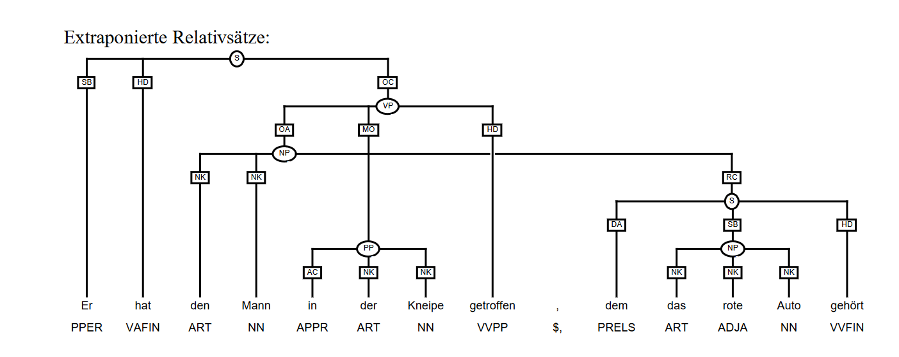
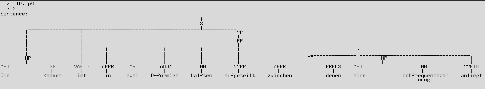
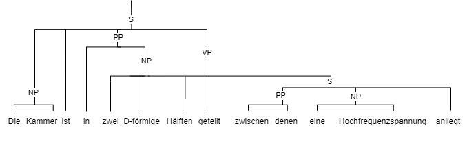

# Data annotation process

All stimuli texts were annotated with corpus based and syntactic features, but also lexical and orthographic features.
A short description of all annotation tags can be found in the [CODEBOOK.md](../CODEBOOK.md) while the decision 
process and more detailed descriptions of manual tags is explained in more detail in the following sections.

## Manual annotation

All text were manually PoS-tagged according to the Suttgart-Tübingen-Tagset 
(Schiller et al. (1999), [STTS](http://www.sfs.uni-tuebingen.de/resources/stts-1999.pdf)).

### Hand-crafted tags

In addition to the standard STTS tags, the following tags were added manually. Those tags reflect features of words 
that are important for studying eye-movements and that might show an effect on eye-movements. 

* **Technical term**: This feature is used to tag two types of technical terms: the first enocodes whether the word is a technical term
that is generally understandable for a layperson (e.g. "DNA") and the second whether the word is a technical term that is only
understandable for a domain expert (e.g. "DNA-Strang").
* **Abbreviation**: If the word is an abbreviation and does not contain other word parts, e.g. "DNA". 
* **Contains abbreviation**: Words that contain an abbreviation, e.g. "DNA-Strang" contains the abbreviation "DNA".
* **Punctuation _before_ the word**: The tags of the punctuation mark(s) (can be more than one) that directly 
_precede_ the current word. If there is no punctuation mark before the word, the tag is "NA".
* **Punctuation _after_ the word**: The tags of the punctuation mark(s) (can be more than one) that directly 
_follow_ the current word. If there is no punctuation mark after the word, the tag is "NA".
* **Quote**: If the word is part of a quote.
* **Parentheses**: If the word is part of an expression in parentheses.
* **Symbol**: If the word contains a symbol (e.g. "+Ende" contains the symbol "+") or other non-latin character.
* **Hyphen**: If the word contains a hyphen (e.g. "DNA-Strang").
* **Clause beginning**: If the word is the first word of a clause.
* **Sentence beginning**: If the word is the first word of a sentence.
* **Word/Char indices in sentence/text**: Several types of positional information on the words and characters in the text or sentences was added as tags. 

## Dependency and Constituency Trees
### STTS tags vs. spacy tags provided by automated tagger in the consticuency and dependency trees files
It is important to notice that the STTS tags are not always identical to the tags provided by the spacy library.
as the spacy tagger is bases on the Tiger annotation schema 
(S. Albert et al. (2003), [TIGER](https://www.linguistics.ruhr-uni-bochum.de/~dipper/pub/tiger_annot.pdf)),
which itself uses the STTS Tagset but differs in the following tags:

|TIGER |  STTS  |  
|------------|-------------|
|PIAT |   PIAT/PIDAT|
|PROAV|   PAV|

The distinction between PIAT and PIDAT is not made and PIAT is used for attributive indefinite pronouns with and without determiners. 
PROAV is used instead of the STTS tag PAV  with the same meaning.
Additionally, ADV Prepositions are tagged as ADV if they modify numerals. 

Furthermore, is the german abbreviation **d.h.** for this means  ("das heisst") treated differently. STTS annotates it as KON whereas the Tiger Schema annotated them seperatly, as
"d." -> PDS and "h." -> VVFIN (S. Albert et al. (2003), [TIGER](https://www.linguistics.ruhr-uni-bochum.de/~dipper/pub/tiger_annot.pdf), p.95).

### Dependency Trees
In addition to the word tags, we provide dependency trees for all the texts. The trees were created with spacy's [Dependency Parser](https://spacy.io/api/dependencyparser)
based on [Tiger2Dep](https://www.ims.uni-stuttgart.de/forschung/ressourcen/werkzeuge/tiger2dep/). The trees are provided as a list of tuples, where the tuples contain the word, PoS-tag and the dependency relation to the head of the word.

> `uncorrected_dependency_trees.tsv`

in the file: 
> `manually_corrected_dependency_trees.tsv`

Manual corrections were made to adjust the trees for the same sentence splits as in the
word features files defined by ``sent_index_in_text``.

An additional colum manually_corrected was added to the file to indicate for which words manual corrections were made.
The file contains the following key columns:

* spacy_word:  The word in the sentence.
* spacy_lemma: The lemma of the word.
* spacy_pos: Part of speech.
* spacy_tag: Detailed POS tag.
* dependency: Dependency relation of the word.
* dependency_head: The head (governing word) of the current word.
* dependency_head_pos: POS of the dependency head.
* dependency_children: List of children (dependent words).
* text_id_numeric: Numeric identifier for the text.
* text_id: Text identifier.
* sent_index_in_text: Index of the sentence in the text.
* manually_corrected: Whether this line was manually corrected.

### Constituency Trees
We also provide constituency trees for all texts. The trees were created using the tool 
[benepar](https://pypi.org/project/benepar/). The trees are provided as a list of tuples, where the tuples contain the word, PoS-tag and are nested according to the sentence structure. 

Small manual corrections were made to adjust the trees for the same sentence splits as in the
word features files defined by ``sent_index_in_text``. 

> `uncorrected_consticuency_trees.tsv`

provides the original annotation of Benepar without manual corrections. However, inspection of the trees showed a lot of errors. 
It had problems parsing quotation marks, relative clauses and other complex structures. 

Therefore, futher manual corrections were necessary, which are provided in: 
> `manually_corrected_constituency_trees.tsv`

Some of the sentences could not be parsed exactly according to the tiger schema and were therefore corrected to the best of the annotators knowledge,
as it is not possible to annotate crossing dependencies with simple parenthesis notation. 
Crossing dependencies are for example present in extrapositioned relative clauses, as show in the following image: 

(S. Albert et al. (2003), [TIGER](https://www.linguistics.ruhr-uni-bochum.de/~dipper/pub/tiger_annot.pdf), pp. 31),

In the provided file, the exprapositoned relative clause is indicated by the doubled labled phrase (VP, PP), where the PP 
describes the relative clause " zwischen denen eine Hochfrewuenzspannung anliegt" which should be subbortdinated to its head "Hälfte"
for the lack of a better solution: 

The correct Constituency tree would look like: 

Examples for sentences, which are not possible to annotate with parathesis are: 
p5 ID 7, p4 ID 6, p3 ID 3, p0 ID 2 & 4 % 5 ,  b4 ID 10, b3 ID 12 & 5, b2 Id 3. 

An additional colum ``manually_corrected`` was added to the file to indicate the corrected sentences.

## DlexDB annotations

Moreover, for each word, several word length measures, lexical frequency measures, and lexical neighborhood measures 
commonly used in reading research were extracted from the lexical database dlexDB  (Heister et al. 2011), which is 
based on the reference corpus underlying the  Digital Dictionary of the German Language (DWDS) corpus (DWDS, 2016). 
All extracted values were manually corrected by a linguistic expert labeller. In particular, the type-to-lemma mapping was disambiguated and incorrect database entries (e.g., incorrect lemmatization) were, whenever possible, corrected and otherwise re-coded as missing values.

### Manual correction

A few annotations needed manual correction either because they were wrong / missing or a different annotation was more 
appropriate for an eye-tracking corpus.
 * **Abbreviation syllables**: Type length in syllables were mostly 1 for abbreviations. The annotation of those words was corrected to reflect the pronunciation 
of the abbreviation (e.g. "DNA" has 3 syllables: "D-N-A")
 * **Remove annotated type frequency**: Some words have too many PoS-tags in the database (e.g. "Mikrotubuli"). The annotated type frequency was 
set to "None" for those words. The same is true for types with too many wrong tags.
 * **Add lemma frequency**: If there was a lemma but not type, the lemma frequency was added.
 * **Wrong PoS-tags**: if the PoS-tag was very clearly wrong, it was corrected (e.g. "Dimer" was tagged as "PIS" instead of "NN"). 
Also, as all words have previously been manually tagged, both tags were compared. If there was a mismatch, the tag was corrected.
 * **No entry**: For words without entry in the dlexDB, the lemma, lemma length, syllables and type length in syllables were added manually.
 * **Wrong lemma**: If the lemma was wrong, it was manually corrected if possible and else recorded as missing value.

# References
S. Albert et al. (2003). tiger Annotationsschema, Universität des Saarlandes and Universität Stuttgart and Universität Potsdam, pp. 1–148.
https://www.linguistics.ruhr-uni-bochum.de/~dipper/pub/tiger_annot.pdf

Schiller, A., Teufel, S., Stöckert, C. (1999). Guidelines für das Tagging
deutscher Textcorpora mit STTS (Kleines und großes Tagset). www.sfs.uni-tuebingen.de/resources/stts-1999.pdf.

Heister, J., Würzner, K.-M., Bubenzer, J., Pohl, E., Hanneforth, T., Geyken, A., Kliegl, R. (2011). dlexDB – eine lexikalische Datenbank für die psychologische und linguistische Forschung. _Psychologische Rundschau, 62_(1), 10–20.

_Das digitale Wörterbuch der deutschen Sprache (DWDS)_. (2016). Berlin-Brandenburg Academy of Science. (http://www.dwds.de)
